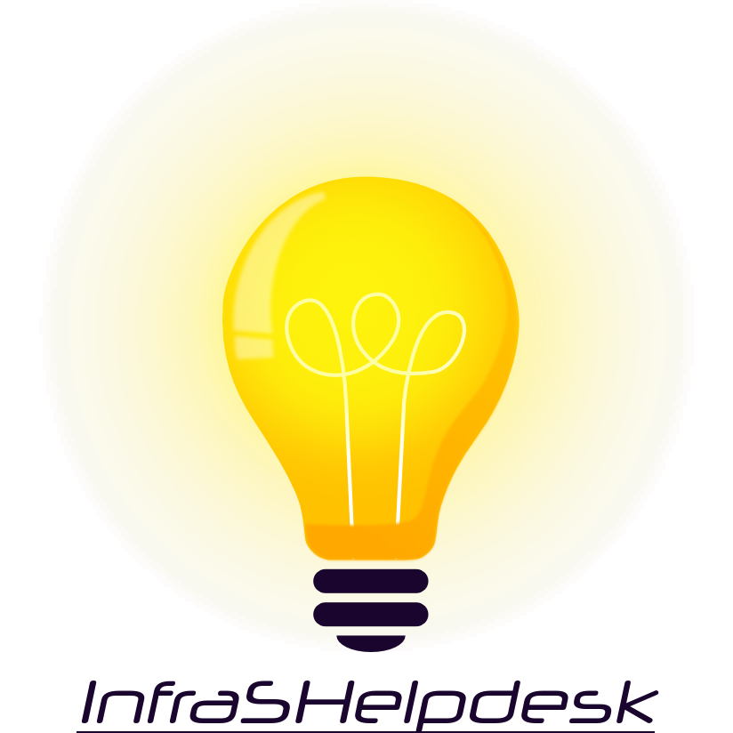

## ***InfraSHelpdesk***

#### Développé par ***InfraS*** - Membre du programme officiel , gage de qualité et d'expertise.

***InfraSHelpdesk*** est un module externe InfraS pour Dolibarr.

## LICENCE

***InfraSHelpdesk*** est distribué sous les termes de la licence GNU General Public License v3 ou supérieure. 

Copyright (C) 2026 Sylvain Legrand - InfraS

Voir le fichier LICENSE pour plus d'informations.

### Autres Licences

Utilise PHP Markdown de Michel Fortin sous licence BSD pour afficher ce fichier README.

## Ce que fait InfraSHelpdesk

***InfraSHelpdesk*** affiche sur toutes les pages un **bouton flottant de contexte** destiné au support et au diagnostic :

* Le clic sur le bouton ouvre un panneau présentant le **contexte de hook de la page courante** et la **liste des modules externes interagissant avec ce contexte**
* Le bouton est déplaçable (souris et tactile) et sa position est mémorisée par navigateur
* Par défaut, seuls les administrateurs voient le bouton ; une option permet de l'afficher à tous les utilisateurs connectés

La gestion de tickets de helpdesk n'est pas encore implémentée — elle sera ajoutée dans une prochaine version.

## Fonctionnalités

### Bouton flottant de contexte
* Affiché sur toutes les pages (utilisateur connecté requis)
* Panneau : page courante, contextes de hook actifs, URL des pages wiki documentant ces contextes, modules externes dont les hooks interagissent avec ces contextes
* Un clic sur une URL wiki ouvre une fenêtre popup (dialog modale) affichant le contenu de la page wiki
* Déplaçable, position mémorisée (localStorage), fermeture au clic extérieur
* Couleurs adaptées automatiquement au thème (support oblyon)

### Dictionnaire de correspondance contextes → wiki
* Table `llx_c_infrashelpdesk_ctxurl` : contexte de hook, fonctions de hook associées, URL de la page wiki
* Seedée avec la liste exhaustive des contextes Dolibarr (générée depuis les sources)
* Éditable via **Accueil / Configuration / Dictionnaires** (URL modifiables, lignes désactivables)

### Descripteur de module
* Déclaration du hook `all` (présence sur toutes les pages), du JS et du CSS du module
* Gestion de version depuis `docs/changelog.xml`
* Vérification de compatibilité Dolibarr et PHP (désactivation automatique si incompatible)
* Vérification de la présence de l'extension PHP `xml`

### Hooks
* `afterLogin` : affiche un avertissement si la version Dolibarr installée dépasse la version maximum supportée par le module
* `printCommonFooter` : injecte la configuration du bouton flottant de contexte

### Pages d'administration
* **Paramètres** : option « Afficher le bouton flottant de contexte pour tous les utilisateurs »
* **À propos** : affichage du README.md en HTML
* **Changelog** : historique des versions, vérification de mise à jour en ligne

## Prérequis

* **PHP** : extension `xml` requise (pour le parsing du changelog)
* **Dolibarr** : le module se place dans le dossier `htdocs/custom/`

## Installation

1. Copier le dossier du module dans `htdocs/custom/`
2. Se connecter à Dolibarr en tant qu'administrateur
3. Aller dans **Accueil / Configuration / Modules/Applications**
4. Rechercher le module et l'activer
5. Configurer via le pictogramme de configuration du module ou les onglets de la page de paramètres

## CE QUI EST NOUVEAU

Voir le fichier `docs/changelog.xml` ou l'onglet **Changelog** dans l'administration du module.

## DOCUMENTATION

Pour la documentation technique détaillée, consulter le fichier `CLAUDE.md` à la racine du module.
