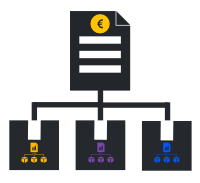

## ***InfraSProject***
#### Développé par ***InfraS*** - Membre du programme officiel , gage de qualité et d’expertise.
* La gestion avancée des projects ***InfraSProject*** apporte de nombreuses améliorations aux fonctions de base :
	 * Un tableau récapitulatif des projets (vue d'ensemble) améliuoré :
	   * Affichage du bénéfice provisoire => Total des devis signés - (total des commandes fournisseur + total des factures fournisseurs non liées à une commande + total des types de frais désirés + total des dépassements de facturation fournisseur) (affichage optionnel)
	   * Affichage du reste à payer pour les commandes fournisseurs
	   * Affichage du reste à facturer pour les devis signés
	   * Affichage des consommations de stock
	   * Possibilité de masqur les tableaux de détails vides (affichage optionnel)
	   * etc...
	 * L'ajout d'articles du stock entreprise dans le projet (Consommations de stock).
	 * L'intégration des couts des consommations de stocks au cout du chantier (projet).
	 * Le lien éventuel entre les consommations de stock et les utilisateurs (exemple : destockage des EPI, outillages, etc...).
	 * Une analyse possible par mois, par consommateur (utilisateur) des couts.
	 * La répartition des lignes de facture fournisseur sur différents projets/chantiers.
	 * L'ajout des lignes de facture fournisseur dans la liste des dépenses projets.
	 * L'utilisation du module externe de suivi des échanges et contacts (ContactTracking - Inovea Conseils) est amélioré.
	 * Etc...

## Licence

***InfraSProject*** est distribué sous les termes de la licence GNU General Public License v3+ ou supérieure. {maxheight150}

Copyright (C) 2016-2025 Sylvain Legrand - InfraS

voir le fichier LICENSE pour plus d'informations

## Autres Licences

Utilise PHP Markdown de Michel Fortin sous licence BSD pour afficher ce fichier README

## Ce qu'est ***InfraSProject***
***InfraSProject*** est un module optionnel de Dolibarr ERP & CRM ajoutant un onglet de gestion des consommation de stock dans la gestion des projets (affaires, chantiers).
	 

## Fonctionnalités (toutes optionnelles)

* Fonctions générales
	* Création d’un menu utilisateur non administrateur pour gérer les paramètres du module
	* Gérer les droits de modification d’un utilisateur non administrateur onglet par onglet
	* Sauvegarder automatiquement les paramètres spécifiques du module lors de la désactivation et réinjecter lesdits paramètres à la réactivation du module
* Onglet Paramètres Dolibarr
	* ***1** Option relative à la liste déroulante de sélection des projets sur les éléments. Si cette liste est renseignée, on peut lier l'objet à des projets appartenant à l'un des tiers sélectionnés.
	* ***2*** Activer les commentaires sur les projets
	* ***3*** Activer les commentaires sur les tâches des projets
	* ***4*** Ignorer les projets clôturés dans la liste de sélection
	* ***5*** Lier un objet fournisseur à n’importe quel projet
	* ***6*** Masquer les boutons créer sur la page "Vue d'ensemble"
	* ***7*** Masquer les boutons délier (devis, commande, facture ...) sur la page "Vue d'ensemble"
	* ***8*** Dans les listes de sélection masquer les projets brouillons ou cloturés
	* ***9*** Masquer les tâches
	* ***10*** Dans la liste des projets afficher la date de début des projets
	* ***11*** Masquer le bouton "lier à" dans l'onglet "Vue d'ensemble"
	* ***12*** Ajouter du temps passé sur les tâches
	* ***13*** Ouvrir systématiquement le projet sur l'onglet choisi ("Vue d'ensemble", Tâches, etc...)
	* ***14*** Éléments à prendre en compte comme déduction dans le calcul du bénéfice
	* ***15*** Éléments à prendre en compte comme addition dans le calcul du bénéfice
	* ***16*** Mettre à jour le taux horaire moyen lors de la saisie du temps passé
	* ***17*** Valider un projet dès la création
	* ***18*** Activer les sous-projets
* Onglets Paramètres généraux
	* Télécharger le fichier de sauvegarde des paramètres
	* Sauvegarder / Restaurer l'ensemble des paramètres du module (une copie de sécurité de la sauvegarde est systématiquement créée dans le répertoire d'administration des documents)
	* PARAMÈTRES DU MODULE
		* ***1*** Choisir un Préfix pour le code inventaire afin de trier les mouvements de stocks liés aux consommations sur projet.
		* ***2*** Définir le mode de recherche des mouvements de stocks liés aux consommations sur projet (par la référence du projet, par le code inventaire comprenant le préfix désiré ou mixe).
		* ***3*** Afficher les consommations de stock dans les élément des projets	pour l'intégration aux calculs de marges.
		* ***4*** Choisir un entrepôt par défaut pour les consommations.	
		* ***5*** Lier les consommations à un utilisateur (Exemple : EPI, outillage, etc...).
		* ***6*** Choisir la ou les catégories de produits sélectionnables pour les consommations de stock
		* ***7*** Créer systématiquement un projet à la signature du devis
		* ***8*** Afficher le dernier échange lié au projet sur l'onglet principal
		* ***9*** Afficher la prochaine action prévue liée au projet sur l'onglet principal
		* ***10*** Afficher le bénéfice provisoire dans l'onglet "Vue d'ensemble" des projets
		* ***11*** Éléments à prendre en compte comme addition dans le calcul du bénéfice provisoire
		* ***12*** Éléments à prendre en compte comme déduction dans le calcul du bénéfice provisoire
		* ***13*** Inclure le total des factures fournisseurs non liées à une commande fournisseur dans le calcul du Bénéfice provisoire.
		* ***14-16*** Choisir les taux de marque à utiliser dans les calculs du droit à dépenser
		* ***17*** Afficher le tableau de calcul du bénéfice provisoire en premier
		* ***18*** Types de lignes de notes de frais à NE PAS PRENDRE EN COMPTE dans le calcul de bénéfice
		* ***19*** Masquer les listes de details vides
		* ***20*** Masquer la liste des commandes clients associées au projet
		* ***21*** Masquer la liste des modèles de facture client associées au projet
		* ***22*** Masquer la liste des propositions commerciales fournisseurs liées à un projet
		* ***23*** Masquer la liste des expéditions associées au projet
		* ***24*** Masquer la liste du temps consommé sur les tâches d'un projet
		* ***25*** Afficher la premiere commande liée à une facture fournisseur dans le détail des Factures fournisseur

## CE QUI EST NOUVEAU

Voir fichier ChangeLog.

## DOCUMENTATION

La documentation est disponible sur le site [wiki.infras.fr](https://wiki.infras.fr/index.php?title=InfraSProject "wiki InfraS").

