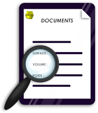

## ***InfraSTechInfos***

* Le pack informations techniques ***InfraS*** facilite la lecture des données techniques des produits et services dans les documents commerciaux.

## Licence

***InfraSTechInfos*** est distribué sous les termes de la licence GNU General Public License v3+ ou supérieure. 

Copyright (C) 2016-2023 Sylvain Legrand - InfraS

voir le fichier LICENSE pour plus d'informations

## Autres Licences

Utilise PHP Markdown de Michel Fortin sous licence BSD pour afficher ce fichier README

## Ce qu'est ***InfraSTechInfos***

***InfraSTechInfos*** est un module optionnel de Dolibarr ERP & CRM qui simplifie la lecture des informations produits.
***InfraSTechInfos*** fonctionne à partir des éléments suivants :
* ***Devis / Commande / Expédition / Demande de prix / Commande***
	 * Listing de l’ensemble des produits présents ayant une ou plusieurs informations techniques renseignées
	 * Affichage des informations suivantes pour chaque produit trouvé :
		* Dimensions
		* Volume	=> unitaire et pour le nombre de pièce prévu sur la ligne
		* Surface	=> unitaire et pour le nombre de pièce prévu sur la ligne
		* Poids		=> unitaire et pour le nombre de pièce prévu sur la ligne
	 * Affichage des informations suivantes pour le document :
		* Volume total (addition des volumes ligne par ligne)
		* Surface totale (addition des surfaces ligne par ligne)
		* Poids total (addition des poids ligne par ligne)
	 * Affichage des informations suivantes pour chaque service trouvé :
		* Durée	=> unitaire et pour le nombre de récurence prévue sur la ligne
	 * Affichage des informations suivantes pour le document :
		* Durée totale (addition des durées ligne par ligne)

## Déploiement / installation

* Utilisez de préférence l'outil de déploiement des modules externes

## Activation des modifications

Pour le bon fonctionnement de la saisie des remises ***InfraSDiscount*** :
* Après toute mise à jour du module
	* Il est IMPERATIF de désactivez puis réactivez le module pour appliquer les modifications nécessaires

## CE QUI EST NOUVEAU

Voir fichier ChangeLog.

## DOCUMENTATION

La documentation est disponible sur le site [wiki.infras.fr](https://wiki.infras.fr/index.php?title=InfraSTechInfos "wiki InfraS").

