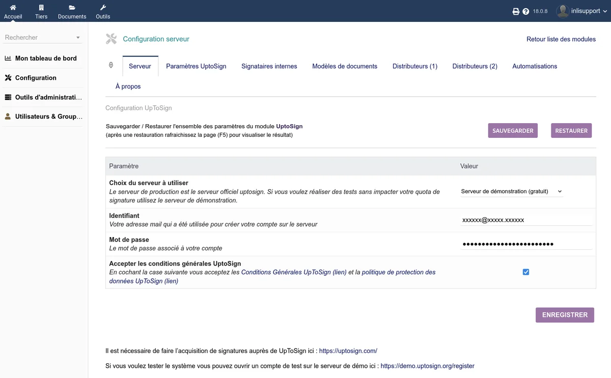
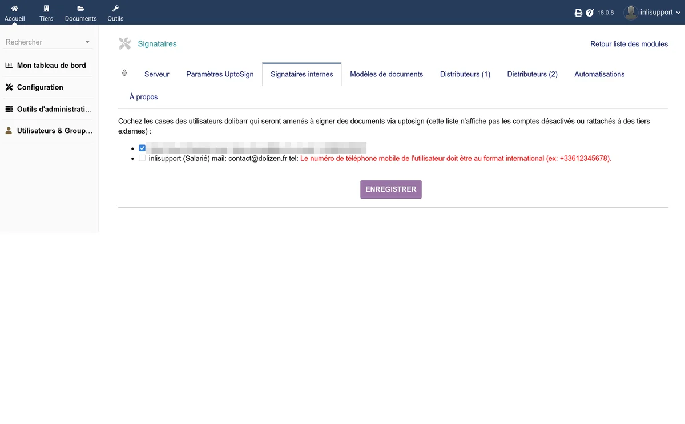

# Configuration

La configuration du module est accessible depuis **Accueil > Configuration > Modules > UptoSign**. Elle est organisée en plusieurs onglets.

## Onglet Serveur

Cet onglet configure la connexion au service UptoSign.

### Choix du serveur

| Option | Description |
|--------|-------------|
| Serveur officiel (production) | Serveur de production UptoSign. Les signatures consomment votre quota. |
| Serveur de démonstration (gratuit) | Serveur de test. Les signatures ne sont pas facturées et n'ont pas de valeur légale. |

### Identifiants

| Champ | Description |
|-------|-------------|
| Identifiant | Adresse e-mail utilisée pour créer votre compte sur le serveur UptoSign |
| Mot de passe | Mot de passe associé à votre compte |
| Accepter les CGU | Vous devez accepter les [Conditions Générales UptoSign](https://www.uptosign.com/cgu/) et la [politique de protection des données](https://www.uptosign.com/ppdp/) |

Après avoir renseigné vos identifiants, cliquez sur **Tester la connexion**. Si le compte n'existe pas encore, le module tente de le créer automatiquement. Si le mot de passe est incorrect, des liens de réinitialisation et de création de compte sont proposés.

### Sauvegarde et restauration

Ce même onglet propose de sauvegarder l'ensemble des paramètres du module dans un fichier, et de les restaurer ultérieurement. Cette fonctionnalité est utile lors d'une migration ou d'une réinstallation.

## Onglet Paramètres

Cet onglet regroupe les paramètres fonctionnels du module.

| Option | Description |
|--------|-------------|
| Compte utilisateur par défaut | Utilisateur Dolibarr utilisé pour les actions anonymes (page publique de signature, tâches planifiées). **Obligatoire**. |
| Suffixe du fichier signé | Suffixe ajouté au nom du fichier signé (exemple : `signe` produit `PR2201-0001-signe.pdf`) |
| Suffixe du fichier de preuves | Suffixe ajouté au nom du dossier de preuves (exemple : `preuves`) |
| Adresse de redirection après signature | URL vers laquelle le signataire est redirigé à la fin du processus |
| Envoyer les mails d'erreurs à | Adresse e-mail destinataire des notifications d'erreur |
| Envoyer une copie des notifications à | Adresse e-mail en copie de toutes les notifications de signature |

### Positionnement automatique

| Option | Description |
|--------|-------------|
| Utiliser PdfToText | Active l'utilisation de la commande système `pdftotext` pour le positionnement automatique des signatures via les mots-clés magiques. Nécessite l'installation de `pdftotext` sur le serveur. Consultez la [documentation des mots-clés magiques](https://doc.cap-rel.fr/projet_uptosign/utiliser_des_mots-cles_magiques). |

### Gestion des contacts et signataires

| Option | Description |
|--------|-------------|
| Créer automatiquement un contact lors de la création d'un tiers | Option interne Dolibarr permettant de créer un contact en même temps qu'un tiers |
| Le premier contact est signataire de tout par défaut | Donne automatiquement tous les droits de signature au premier contact créé lors de la création d'un tiers |
| Forcer UptoSign comme système de signature par défaut | Pré-remplit le champ "Signature électronique" sur tout nouvel objet |
| Forcer UptoSign pour les objets clonés | Applique UptoSign comme système de signature par défaut sur les objets clonés |
| Autoriser tout contact lié à signer | Permet à tout contact client lié au document de le signer, sans avoir à lui affecter le rôle "Signature électronique" |
| Permettre au client de créer son contact signataire | Le client peut indiquer les coordonnées du signataire depuis la page publique de signature. Consultez la [documentation dédiée](https://doc.cap-rel.fr/projet_uptosign/ajout_du_contact_signataire_par_le_client). |

### Options diverses

| Option | Description |
|--------|-------------|
| Ajouter le poste/fonction du contact | Affiche le poste et la fonction du signataire sur le document PDF signé, en plus de son nom |
| Signature locale | Ajoute un bouton pour lancer le processus de signature en présence du client, sans envoi d'e-mail |
| Activer les services à la signature du contrat | Active automatiquement tous les services d'un contrat lorsque celui-ci est signé via UptoSign |

### Zone expérimentale

| Option | Description |
|--------|-------------|
| Mode d'envoi du code de double authentification | Par défaut, le code est envoyé par SMS (signature renforcée). Le choix de l'e-mail affaiblit le niveau de la signature. |
| Personnaliser le mode par tiers | Permet de choisir au cas par cas quels tiers reçoivent le code par e-mail plutôt que par SMS |
| Pseudo-anonymisation | Masque partiellement les adresses e-mail et numéros de téléphone sur les documents. UptoSign archive alors le dossier de preuves pendant 10 ans. Cette option est facturée : 1 signature compte pour 2. |
| Désactiver le debug des requêtes réseau | Réduit le niveau de journalisation lors des appels HTTP vers l'API UptoSign |

## Onglet Signataires internes

Cet onglet affiche la liste des utilisateurs Dolibarr actifs (non désactivés et non rattachés à des tiers externes). Cochez les cases des utilisateurs qui sont amenés à signer des documents via UptoSign.

Un utilisateur doit avoir la permission **Utilisateur pouvant signer** dans ses droits Dolibarr pour que la signature fonctionne. Son adresse e-mail et son numéro de téléphone mobile (au format international, par exemple `+33612345678`) doivent être renseignés.

## Onglet Modèles de documents

Cet onglet donne accès à la liste des configurations de documents. Chaque configuration associe un type d'objet Dolibarr (devis, facture, contrat, etc.) à un modèle de document PDF, avec les positions du sceau et des signatures.

Pour créer une nouvelle configuration :

1. Cliquez sur **Nouveau cadre**
2. Sélectionnez le type d'objet et le modèle de document PDF correspondant
3. Choisissez si le document doit être signé ou scellé
4. Définissez les coordonnées et la page du sceau UptoSign
5. Définissez les coordonnées et la page de chaque zone de signature
6. Choisissez le mode d'authentification (SMS ou e-mail) et la redirection après signature

> **Attention** : le numéro de page peut être négatif si vous comptez en partant de la dernière page. Cela est utile lorsque le nombre de pages varie (par exemple en présence de CGV).

### Positionnement des signatures

Les coordonnées de signature sont exprimées en millimètres (x, y du coin supérieur gauche). Vous pouvez :

- Saisir les coordonnées manuellement dans les champs du formulaire
- Déplacer les étiquettes directement sur l'aperçu du document PDF

## Onglet Distributeurs

Cet onglet est réservé aux comptes revendeurs/distributeurs. Si votre compte est un compte distributeur actif, vous accédez à des outils spécifiques :

- **Mes clients** — Liste des clients rattachés à votre compte revendeur
- **Données de facturation** — Données brutes de consommation de vos clients sur les 6 derniers mois
- **Assistant de création de contrats** — Créez automatiquement les contrats et factures récurrentes pour vos clients UptoSign
- **Tâche planifiée revendeur** — Met à jour mensuellement les quantités consommées par vos clients

## Onglet Automatisations

Cet onglet configure les automatismes déclenchés par les événements de signature.

| Option | Description |
|--------|-------------|
| Création automatique d'une facture à la signature du devis | Génère une facture lorsqu'un devis est signé via UptoSign |
| Sceller automatiquement la facture issue du devis signé | Scelle la facture générée automatiquement |
| Envoyer par e-mail la facture générée | Envoie la facture par e-mail au client, avec le modèle de mail de votre choix |
| Fermeture automatique d'une commande lors de sa signature | Classe automatiquement la commande comme livrée lorsqu'elle est signée |

> **Attention** : si le module Workflow de Dolibarr est déjà configuré pour créer une commande à la signature d'un devis, l'activation simultanée de la création automatique de facture peut entraîner un comportement inattendu (devis signé produisant à la fois une commande et une facture).

## Onglet À propos

Cet onglet affiche les informations sur la version du module et l'éditeur.
