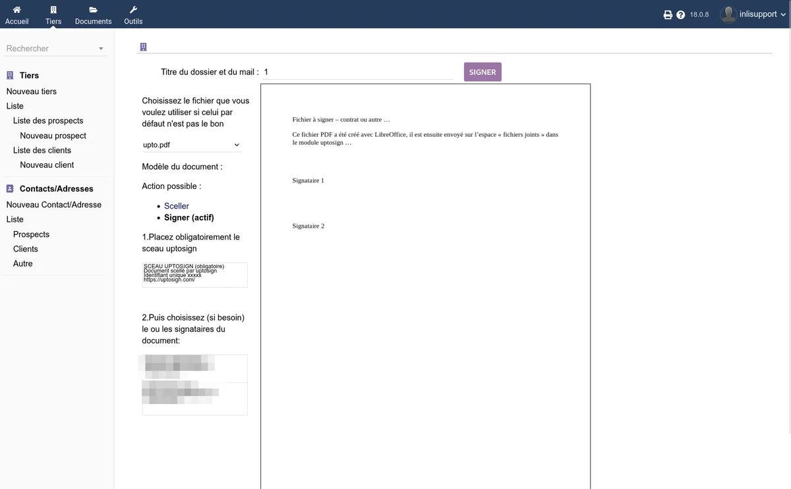

# Utilisation

## Accès au module

UptoSign est accessible depuis le menu **GED** (Gestion Électronique de Documents) dans le menu latéral gauche de Dolibarr. Vous y trouvez :

- **UptoSign** - Historique de toutes les signatures et scellements
- L'onglet **Signature électronique** est ajouté sur chaque fiche de document pris en charge (devis, commande, facture, contrat, intervention, projet, tiers, utilisateur)

## Signer un document

### Étape 1 : générer le PDF

Avant de lancer une signature, assurez-vous qu'un fichier PDF est associé au document. Depuis la fiche du document, générez le PDF via le bouton habituel de Dolibarr.

### Étape 2 : ouvrir l'onglet Signature électronique

Cliquez sur l'onglet **Signature électronique** de la fiche. L'assistant de positionnement s'ouvre dans une fenêtre dédiée, sans les menus ni les styles de Dolibarr : c'est ce qui garantit que les signatures se placent exactement là où vous les déposez, quel que soit le thème ou les autres modules installés. Si plusieurs fichiers PDF sont associés au document, sélectionnez celui que vous souhaitez utiliser.

Pour revenir à la fiche sans lancer de procédure, fermez la fenêtre avec la croix en haut à droite (ou la touche Échap).

### Étape 3 : positionner le sceau et les signatures

1. **Placez le sceau UptoSign** - Le sceau est obligatoire. Déplacez l'étiquette du sceau sur l'aperçu du document ou saisissez les coordonnées manuellement (en millimètres, coin supérieur gauche). Indiquez le numéro de page.
2. **Placez les signatures** - Choisissez le ou les signataires du document parmi les contacts liés à la fiche. Pour chaque signataire, positionnez la zone de signature sur le document.

> **Conseil** : le numéro de page peut être négatif pour compter en partant de la fin. Par exemple, `-1` désigne la dernière page.

### Étape 4 : envoyer la demande

1. Saisissez le titre du dossier et du mail
2. Cliquez sur **Envoyer ce document à la signature** (ou **Sceller et horodater ce document** pour un scellement)

Le signataire reçoit un e-mail contenant un lien vers la page publique de signature. Un QR code est également disponible pour un accès rapide.

### Étape 5 : suivi et téléchargement

Depuis l'onglet **Signature électronique**, vous suivez l'état du processus :

| État | Signification |
|------|---------------|
| En attente | Le document est en file d'attente sur le serveur UptoSign |
| Signé | Le document a été signé par tous les signataires |
| Scellé | Le document a été scellé et horodaté |
| Téléchargé | Le document signé/scellé a été rapatrié dans Dolibarr |
| Erreur | Une erreur est survenue lors du processus |
| Annulé | Le processus a été annulé |
| Refusé | Le correspondant a refusé de signer le document |
| Expiré | Le délai de signature a été dépassé |

Une fois le document signé ou scellé, cliquez sur **Télécharger le document signé** (ou **Télécharger le document scellé**) pour récupérer le fichier dans les pièces jointes de Dolibarr. Vous pouvez également télécharger le **dossier de preuves** associé à la signature.

## Sceller un document

Le scellement fonctionne de la même manière que la signature, mais sans intervention d'un tiers signataire. Seul le sceau UptoSign est nécessaire. Le document est horodaté et son intégrité est garantie.

Depuis l'onglet **Signature électronique**, positionnez le sceau puis cliquez sur **Sceller et horodater ce document**.

## Signature locale

Si vous êtes en présence de votre client, vous pouvez utiliser la **signature locale**. Cette fonctionnalité lance le processus de signature directement, sans envoyer d'e-mail au signataire. Le client signe sur votre écran ou sur son appareil.

Pour activer cette fonctionnalité, cochez l'option **Signature locale** dans les [paramètres du module](/uptosign/configuration).

## Signature en masse

La signature en masse permet d'envoyer un **même document** à plusieurs destinataires, chacun signant **indépendamment** sur sa propre copie. Chaque destinataire reçoit son lien personnel et signe sans voir les autres signataires.

Le mode opératoire complet (création de l'enveloppe, ajout des destinataires depuis 7 sources possibles, format CSV pour l'import, validation, positionnement et envoi, suivi des destinataires) est détaillé sur la page dédiée : [Signature en masse](/uptosign/signature-en-masse).

> **Limite** : 30 destinataires maximum par enveloppe. Au-delà, créez plusieurs enveloppes successives.

## Actions de masse depuis les listes

UptoSign ajoute des actions de masse dans les listes de documents Dolibarr. Depuis la liste des factures, des devis, des commandes, des contrats, des fiches d'intervention, des expéditions ou des projets, vous pouvez sélectionner plusieurs éléments et lancer :

- **Sceller un lot de factures** (via UptoSign)
- **Sceller un lot de propositions commerciales** (via UptoSign)
- **Sceller un lot de commandes** (via UptoSign)
- **Sceller un lot de contrats** (via UptoSign)
- **Sceller un lot de fiches d'intervention** (via UptoSign)
- **Sceller un lot d'expéditions** (via UptoSign)
- **Sceller un lot de projets** (via UptoSign)

## Page publique de signature

Le signataire reçoit un lien par e-mail vers une page publique qui ne nécessite aucun compte Dolibarr. Sur cette page, il peut :

- Consulter le document à signer
- **Accepter et signer** le document en validant son identité par un code de double authentification (SMS ou e-mail)
- **Refuser** le document

Si l'option de création de contact signataire en ligne est activée, le signataire peut également renseigner ses coordonnées directement depuis la page publique.

## Historique des signatures

L'historique complet des signatures et scellements est accessible depuis le menu **GED > UptoSign**. Cette liste affiche pour chaque opération :

| Colonne | Description |
|---------|-------------|
| Réf pièce | Référence de l'objet Dolibarr signé |
| Type pièce | Type du document (devis, facture, contrat, etc.) |
| État UptoSign | État actuel du processus |
| Contact signature | Contact désigné comme signataire |
| Utilisateur | Utilisateur Dolibarr ayant lancé le processus |
| Date traitement | Date de la dernière action |

### Vérification d'intégrité

Depuis l'historique, vous pouvez vérifier la somme de contrôle d'un fichier signé. Cette vérification compare l'empreinte du fichier présent sur votre espace de stockage avec l'empreinte du fichier original. Si les deux correspondent, le fichier n'a pas été modifié.

### Synchronisation

Le bouton **Synchronisation UptoSign** permet de forcer la mise à jour de l'état d'un processus de signature auprès du serveur UptoSign.

## Modèles d'e-mails

UptoSign installe automatiquement des modèles d'e-mails pour chaque type de document :

| Modèle | Usage |
|--------|-------|
| Demande de signature (devis, commande, contrat, intervention, expédition) | E-mail envoyé au signataire pour lui demander de signer |
| Confirmation de signature | E-mail de confirmation envoyé après la signature |
| Rappel | E-mail de rappel si le document n'a pas encore été signé |
| Refus | E-mail envoyé lorsque le signataire refuse le document |

Si aucun modèle n'est trouvé dans la langue du destinataire, le modèle français est utilisé par défaut.

## Permissions

Le module définit les permissions suivantes, configurables dans **Accueil > Configuration > Utilisateurs > Permissions** :

| Permission | Description | Par défaut |
|------------|-------------|------------|
| Lire les signatures | Consulter l'historique des signatures | Oui |
| Lancer un processus de signature ou scellement | Créer et envoyer des demandes de signature | Oui |
| Annuler un processus de signature | Supprimer une procédure en cours | Non |
| Utilisateur pouvant signer | Autorise l'utilisateur Dolibarr à signer des documents | Non |
| Consulter les dossiers salariés | Accéder aux dossiers à faire signer aux salariés | Non |
| Créer des dossiers salariés | Créer des dossiers de signature pour les salariés | Non |
| Lire les configurations | Consulter les configurations de modèles de documents | Non |
| Créer/modifier les configurations | Ajouter ou modifier des configurations de documents | Non |
| Supprimer les configurations | Supprimer des configurations de documents | Non |
| Lire les listes de signatures | Consulter les listes de signature en masse | Oui |
| Créer/modifier les listes | Créer ou modifier des listes de signature en masse | Oui |
| Supprimer les listes | Supprimer des listes de signature en masse | Non |
